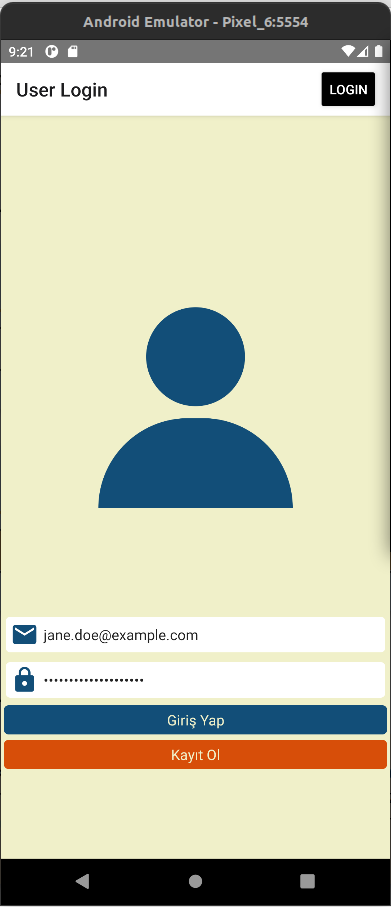
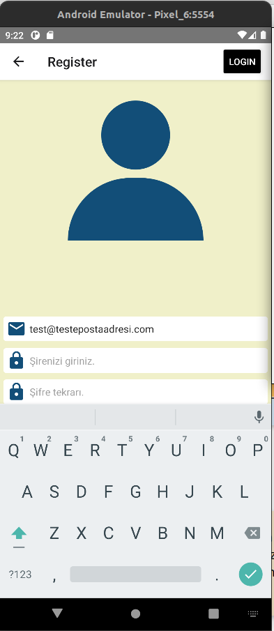
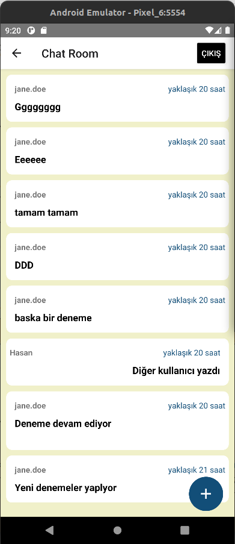
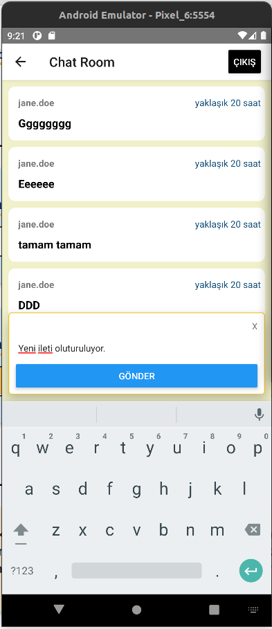
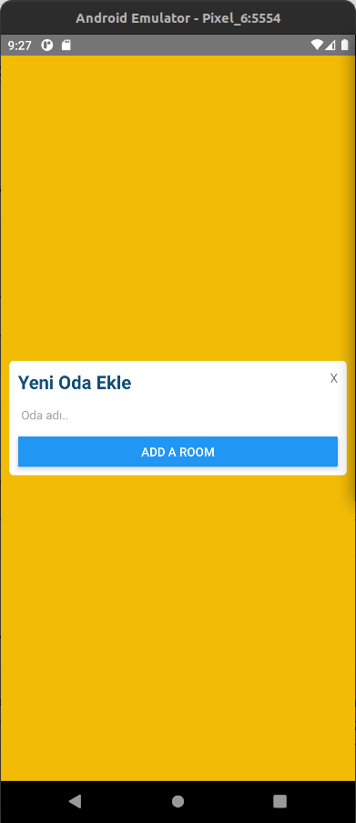

# TKodKonus

Tamamen eğitim amaçlı geliştirilmiş bir projedir. Firebase auth ve realtime veritabanı kullanılarak React Native ile geliştirilmiştir. Uygulama şuan için sadece Android için optimize edilmiştir. IOS ile çalışması için yüklenen paketlerin IOS ayarlarının yapılması gereklidir.

Uygulama geliştirilirken.

- React Native Navigation
- React Native Navigation Stack
- Redux
- React Redux
- React Native Firebase
- Rate-fns
- React Native Flash Message
- React Native UUID
- React Native Vector Icons

Paketleri kullanılmıştır.

## Kullanıcı İşlemleri

Kullanıcın sisteme giriş yapabilmesi için önce kayıt olması ve sonrasında login işlemini yapması gerekmektedir.

Giriş yapan kullanıcı sohbet odalarının olduğu sayfaya yönlendirilir. İstediği odaya girerek sohbet edebilir veya kendisi de yeni bir sohbet odası oluşturabilir.

## Ekran Görüntüleri

### Login Ekranı

### Kayıt Ekranı

### Sohbet Odaları

### Sohbet Odası

### Yeni İleti

### Yeni Oda Oluştur
